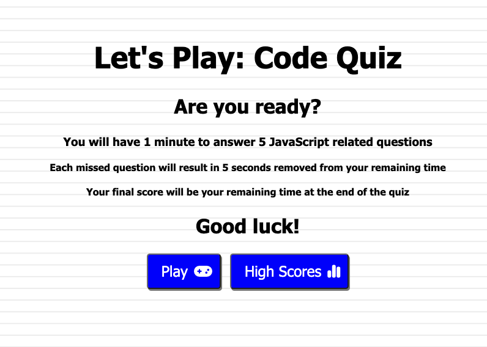

# Code Quiz

## Description

- In our Module 4 Challenge, we were asked to create timed quiz on JavaScript fundamentals that allows users to play through the game and save their scores.

- In this game function, the user will have 1 minute to answer 5 JavaScript related questions. For each missed question, an additional 5 seconds will
be subtracted from their score. At the end of the quiz, the user will input their initials and their score will be saved, thus being able to access a list
of the saved high scores at a later point.

- The user will also have the option to be taken back to the start of the quiz and play again upon reaching the end of the game. 

## Usage

- Please follow the deployed GitHub page link provided to play the quiz: 

